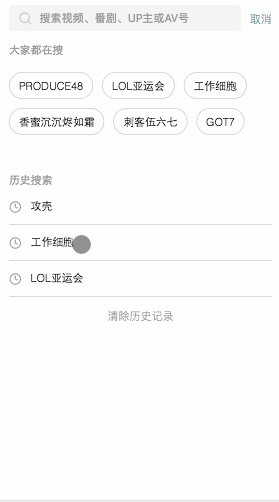

# 📺 GiriGiri

+ 伪·bilibili, only for studying.
+ 高仿哔哩哔哩h5 之 ギリギリ (大雾...(つ｀Д｀)･ﾟ･

## Demo
+ 📺 [在线预览: 移动端GiriGiri](http://robbyvan.cn/giri)
+ 📱 使用手机浏览器打开获得更佳体验~      


### 推荐

### 排行榜

### 搜索

### 播放页面

### 用户


## 技术
#### 前端
  + ```Vue + Vuex + Vue-router```: 采用Vue全家桶构建前端代码, 引入Vuex管理组件间共享状态, 页面路由采用Vue-router的hash模式管理, 同时利用路由懒加载优化首屏体验.
  + ```Service Worker```: 缓存静态资源, 如css/png/gif/js等, 配合sw版本控制, 可更新已换成的资源
  + ```vue-lazyload```: 图片懒加载, 优化用户体验.
  + ```自适应```: 配合throttle监听resize完成对根节点```<html>```的字体修正, css单位采用rem完成移动端适配.
  + ```布局```: 基本使用flex完成布局, 局部采用```position: absolute```进行定位.

#### 后端
  + ```Express```: 采用express框架搭建代理, 转发对B站api请求 , 解决了部分前端跨域请求的问题
  + ```Https```: 采用https server, 以支持前端service worker的使用.

#### 部署
  + ```Nginx```: 采用Nginx实现反向代理, http请求重定向为https, 转发请求至9002端口
  + ```pm2```: 利用pm2管理node进程, 方便监控. 同时其内建负载均衡可以协助提升性能 (然而云服务器只有1个CPU..._(:з」∠)_


## 主要功能
首页推荐, 排行榜, 搜索, 播放器, 用户中心

### 首页推荐
+ 配合debounce监听scroll事件, 计算当前scroll的百分比. 当超过某一阈值后来完成"自动加载", 和显示"返回顶部"按钮.
+ 导航下拉动画采用vue的```<transition>```实现

### 排行榜
+ 封装了视频列表组件```<video-list />```展示视频列表, 在多处实现了复用.

### 播放页
+ 利用```html5```的```<video />```标签实现MP4格式视频的播放.
+ 播放进度条的拖拽点击可以实时修改播放进度(利用进度条百分比控制video的播放时间)
+ 对于各视频描述panel不等高的情形, 利用js的getBoundingClientRect()计算panel高度以完成折叠动画.

### 搜索
+ 包括搜索框, 热搜词, 历史搜索, 搜索建议, 搜索结果, 通过vue双向绑定搜索query, 结合debounce节约http请求次数.

### 用户中心
+ 利用本地存储```localstorage```记录用户的最近播放

## 缓存
+ 利用Service Worker完成缓存
+ ```install```阶段完成对静态资源的prefetch.
+ 对于```fetch```阶段, 采用"先返回, 再更新"的策略, 具体来说就是如果有缓存, 则返回缓存结果给浏览器, 但同时sw也会向服务器进行请求, 并更新缓存资源供下次使用.
+ 当```sw.js```文件发生更新, 新的sw在```activate```阶段会删除上个版本的所有cache
+ 对于根目录的缓存, ```index.html```会通过```SW.controller.postMessage(location.href)```发送message, sw监听```message```事件以更新更新根目录下的```index.html```


## Todo
[] 弹幕播放器(目前支持视频的播放, 弹幕仅在控制台输出)
[] 不支持"番剧"类视频播放的UI提示

## Build Setup
```
  yarn        # install dependencies
  yarn dev    # dev server running at localhost:8080
```
